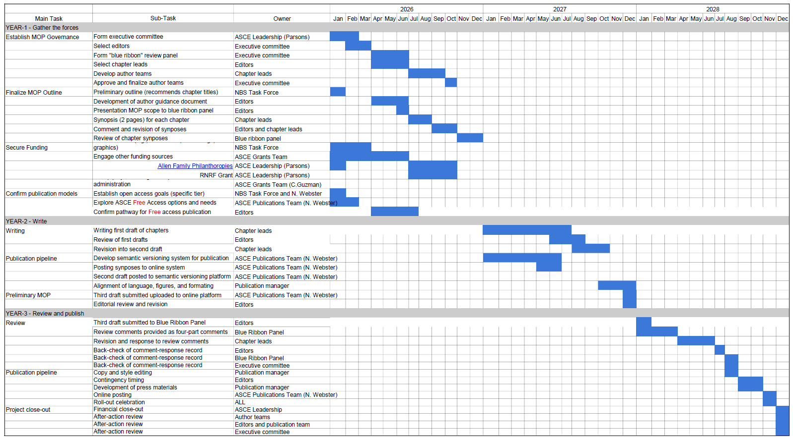

# (PART) Front Matter {-} 

# Manual Development Process {-}

<span style="color: red;">ALL CONTENT IN THIS REPORT IS PRELIMINARY AND DRAFT. DO NOT REFERENCE FOR ANY PURPOSE.</span>

Insert content.

## Purpose  {-}
Insert.

## Outline  {-}
Insert.

```{r tab-outline, tab.cap="Proposed outline for a manual of practice on nature-based solutions"}
#Create empty table
Table00.outline <- as.data.frame(matrix(NA, nrow = 0, ncol = 3))
colnames(Table00.outline) <- c("Chapter", "Representative Themes", "Chapter Leads")

#Specify rows of the table
Table00.outline[1,] <- c("(1) Introduction and purpose", "Need for engineering-oriented NBS guidance, audience, geographic scope", "McKay, Corwin, Dorman")  
Table00.outline[2,] <- c("(2) Foundations of NbS", "Defining NbS, typology of NBS, existing guidelines and standards, principles of engineering design.", "TBD")  
Table00.outline[3,] <- c("(3) Qualitative foundations of project planning", "Systems context, design objectives, risk tolerance.", "TBD")  
Table00.outline[4,] <- c("(4) Community Engagement", "Interdisciplinary dialog, ways of knowing, facilitation", "TBD")  
Table00.outline[5,] <- c("(5) Analysis of NbS", "Levels of effort, project outcomes, project performance, monetary cost, non-monetary cost", "TBD")  
Table00.outline[6,] <- c("(6) Alternatives Analysis", "Management measures, alternative development, decision support, trade-off analysis", "TBD")  
Table00.outline[7,] <- c("(7) Performance-based Design", "Iterative workflows, integrated modeling, hazard resilience and reliability, adaptability", "TBD")  
Table00.outline[8,] <- c("(8) Constructability", "Material selection, regulatory requirements, developing specifications, construction oversight", "TBD")  
Table00.outline[9,] <- c("(9) Project Establishment", "Preliminary monitoring, adaptive management, pass-off to operations", "TBD")  
Table00.outline[10,] <- c("(10) Asset Management", "OMRR&R, life cycle budgeting, end of life span planning", "TBD")  

#Send output table rows into a single matrix
rownames(Table00.outline) <- NULL
knitr::kable(Table00.outline, align="llc")
```


## Timeline  {-}
Insert.


```{r fig-manual-timeline, fig.cap="Proposed timeline for development of a manual of practice"}

```

