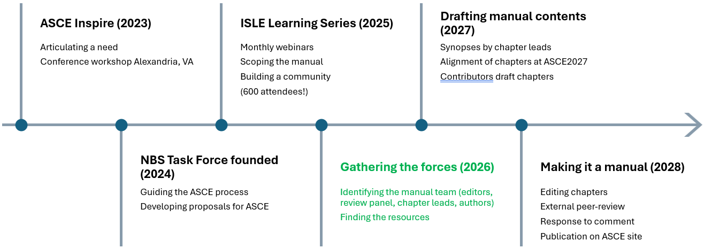

# (PART) Front Matter {-} 

# Manual Development Process {-}

<span style="color: red;">ALL CONTENT IN THIS REPORT IS PRELIMINARY AND DRAFT. DO NOT REFERENCE FOR ANY PURPOSE.</span>

Insert content.  Describe the what (outline), who (roles), and when (timeline) of the manual.


## Outline  {-}
Insert.

```{r tab-outline, tab.cap="Proposed outline for a manual of practice on nature-based solutions"}
#Create empty table
Table00.outline <- as.data.frame(matrix(NA, nrow = 0, ncol = 3))
colnames(Table00.outline) <- c("Chapter", "Representative Themes", "Chapter Leads")

#Specify rows of the table
Table00.outline[1,] <- c("(1) Introduction and purpose", "Need for engineering-oriented NBS guidance, audience, geographic scope. Defining NBS and providing a typology of NBS.", "McKay, Corwin, Dorman")  
Table00.outline[2,] <- c("(2) Qualitative foundations of project planning", "Engineering principles, systems context, primary and secondary design objectives, risk tolerance, constraints, design maturity targets.", "TBD")  
Table00.outline[3,] <- c("(3) Engagement by engineers", "Project management, interdisciplinary dialog, ways of knowing, ladder of participation, facilitation, co-production", "TBD")  
Table00.outline[4,] <- c("(4) Site assessment", "Developing systems context. Compiling and integrating data. Identifying site constraints. Using site assessment to define availability of green-to-grey methods.", "TBD") 
Table00.outline[5,] <- c("(5) Analysis of NbS", "Levels of effort, assessing outcomes/benefits, project performance, monetary cost, non-monetary cost", "TBD")  
Table00.outline[6,] <- c("(6) Alternatives Analysis", "Management measures, alternative development, decision support, trade-off analysis", "TBD")  
Table00.outline[7,] <- c("(7) Performance-based Design", "Iterative workflows, integrated modeling, hazard resilience and reliability, adaptability", "TBD")  
Table00.outline[8,] <- c("(8) Constructability", "Material selection, regulatory requirements, developing specifications, construction oversight", "TBD")  
Table00.outline[9,] <- c("(9) Adaptive Management", "Compliance monitoring, performance monitoring, adaptive management, transition to operations", "TBD")  
Table00.outline[10,] <- c("(10) Asset Management", "Condition assessment and inspection, operations, maintenance, repair, rehabilitation, decommissioning, life cycle budgeting", "TBD")  

#Send output table rows into a single matrix
rownames(Table00.outline) <- NULL
knitr::kable(Table00.outline, align="llc")
```


## Roles and Responsibilities  {-}

What are people signed up for? How were groups picked? Science vs practice, geography, discipline, positionality, engr leadership. 

```{r tab-roles, tab.cap="Proposed outline for a manual of practice on nature-based solutions"}
#Create empty table
Table00.roles <- as.data.frame(matrix(NA, nrow = 0, ncol = 4))
colnames(Table00.roles) <- c("Role", "Description", "Responsibilites", "Personnel")

#Specify rows of the table
Table00.roles[1,] <- c("EWRI Technical Committee", "Long-term standing committee advancing NBS in ASCE", "Lead society-wide initiatives on education, policy, standards, etc.", "Tami Jameson (Chair)")  
Table00.roles[2,] <- c("NBS Task Force", "", "Initiated NBS manual development. Secures funding. Initiates and coordinates other NBS products (e.g., other manuals)", "Emily Corwin (Chair)")  
Table00.roles[3,] <- c("ASCE Staff", "Full-time employees of the society stewarding ASCE activities", "Coordinates and connects across the society. Serves as lead granting entity on proposals. Provides support on file sharing, publishing models, etc.", "Brian Parson, Ruth Hocker, Jay Snyder")  
Table00.roles[4,] <- c("ASCE Executive Committee", "Standing committee at the society level representing all institutes", "Oversees MOP development across the society. Approves editors and blue ribbon panel. Ensures quality of the review, response, and revision processes.", " (Chair)")  
Table00.roles[5,] <- c("MOP Editors", "Overarching leadership for this manual", "Develops scope and outline. Leads coordination across executive committee, author teams, and blue ribbon panel. Identifies chapter leads and oversees content development. Aligns content and voice across chapters.", "Kyle McKay, Emily Corwin, Troy Dorman")  
Table00.roles[6,] <- c("Project Managers", "", "Facilitates author team meetings. Develops author guidance. Coordinates logistics with ASCE staff and editorial team.", "Margaret Libby, Nicole Del Monaco")  
Table00.roles[7,] <- c("Blue Ribbon Panelists", "High-level, independent oversight of the MOP", "Reviews MOP outline and process. Formal comments on chapter synopses, first-order drafts, and second-order drafts. Reviews response to comments.", "Pending approval by ASCE Executive Committee (Oct 2026)")  
Table00.roles[8,] <- c("Chapter Leads", "Two leaders focused on the state-of-the-practice and state-of-the-science for each focal topic", "Leads compilation of chapter-scale content. Coordinates content with Editors. Responds to comments and revisions.", "Outreach underway by Editors (Nov 2026)")  
Table00.roles[9,] <- c("Chapter Contributors", "Author teams assembled by the Chapter Leads and Editors", "Contributes content as directed by the chapter leads. Gathers content and methods from audiences not engaged in MOP development.", "Outreach after chapter lead selection (Dec 2026 / Jan 2027")  

#Send output table rows into a single matrix
rownames(Table00.roles) <- NULL
knitr::kable(Table00.roles, align="cllc")
```


## Timeline  {-}
Insert.

Major milestones:

- Oct 2026: ASCE Executive committee reviews Blue Ribbon Panel.  
- Nov 2026: Editors request participation by chapter leads.  
- Dec 2026: Author teams are assembled.  
- Jan-Feb 2027: Chapter leads develop outlines and synposes with author teams.  
- March 1-5, 2027: [ASCE2027](https://experience.asce.org/) will convene in Philadelphia. We anticipate an initial gathering of chapter leads, blue ribbon panel members, and others engaged in the manual development.  
- Mar 2027: Revision of chapter synopses by Chapter Leads.  
- Apr 2027: Review of synopses by Blue Ribbon Panel.  
- May-Nov 2027: Chapter teams assemble draft content with ongoing input from editors.  
- Fall 2028: Publication of MOP. 


```{r fig-manual-timeline, fig.cap="Proposed timeline for development of a manual of practice"}

```

