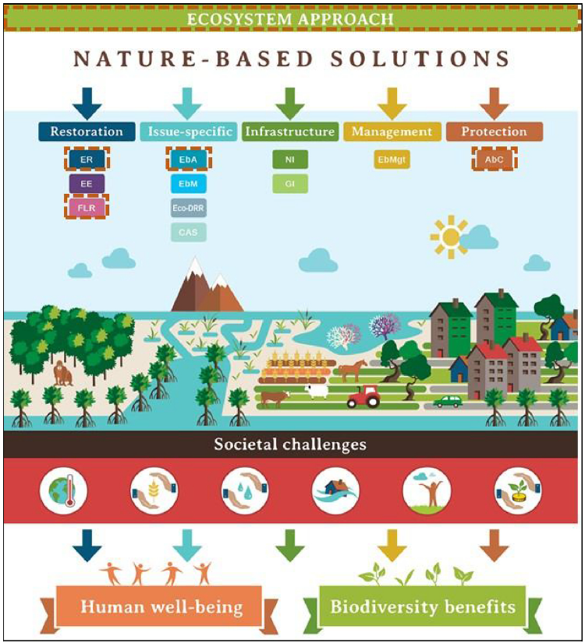
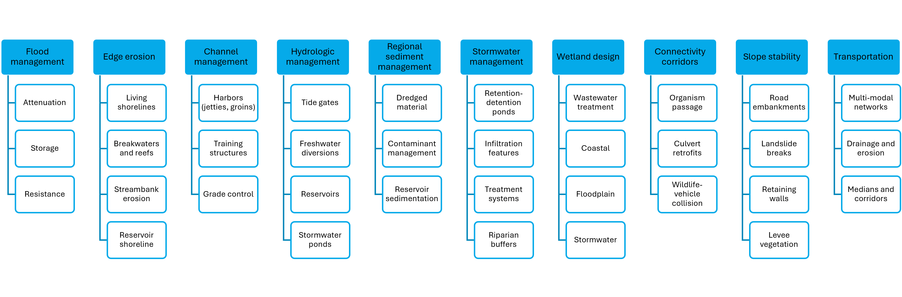
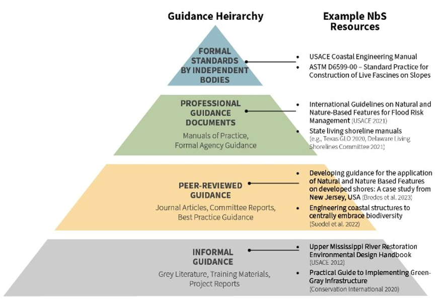

# (PART) Manual of Practice {-} 

# Introduction

S. Kyle McKay, Emily Corwin, and Troy Dorman

<span style="color: red;">ALL CONTENT IN THIS REPORT IS PRELIMINARY AND DRAFT. DO NOT REFERENCE FOR ANY PURPOSE.</span>


## The context for nature-based solutions

History of infrastructure and conservation. Uniting of fields of practice (Mace 2014, McKay et al. 2023).  

Stakeholder desires for multi-purpose infrastructure. 

Growing body of examples. Link to case study databases like EWN Atlases, Natura roadmap, Duke's DOI database, etc.


## What is the scope of natural infrastructure?

Wide array of lexicon on the topic.  

- Physical features: NBS, NI, green infrastructure.  
- Initiatives and philosophy of how this is done: Engineering with NAture, Working with nature (PIANC), etc.  
- Disciplines: ecological engineering, restoration ecology, landscape architecture. 

### Definition of Natural Infrastructure (NI)

NBS definitions from White House, EU, ICUN, World Bank. Explain that these include a broad array of topics (Sacham-Cohen et al. 2019) like NI, ecosystem based adaptation, natural climate solutions, restoration, and conservation.  

```{r fig-nbs-definitions, fig.cap="NBS as an umbrella subject including a wide array of management types."}

```

Natural infrastructure as a subset of NBS. Definition of NI in practical terms. Multiple criteria, any of which may not be met (McKay et al. 2023):  

- Addressing infrastructure problems.  
- Using natural materials and/or facilitating natural processes.  
- Intentionally designed with social outcomes aligned with stakeholder needs.  
- Self-organizaed, resilience.  
- Acknowledges landscapes, but is implemented at project-scales.

Example figure of how these spectra play out?

### A problem-centric typology of NI

Allude to the common theme of a spectrum of actions (e.g., living shoreline diagrams). Green, grey, hybrid.  

How does engineering practice work? Centered on client-specified problems or missions.  

Present Problem-centric typology. How were these developed?

```{r fig-nbs-typology, fig.cap="Typology of natural infrastructure."}

```

NBS touching many areas of engineering practice. This manual as an enabler of NI in multiple civil engineering disciplines. 

## The need for engineering guidance

What is guidance (Corwin et al. 2026)? Spectrum. Massive growth of interdisciplinary guidance on nature-based solutions. 

```{r fig-guidance-hierarchy, fig.cap="Hierarchy of guidance across areas of engineering practice."}

```

Why is a manual of practice needed for engineers?  

- Risk mitigation and minimization of liability (Shudtz docs, ASCE liability references).  
- Translation of NBS concepts into engineering lexicon.  
- Connecting NBS to multiple engineering sectors.  
- Reducing redundancy and freeing other NBS guidance to focus on details.

What type of guidance is needed for NBS? Analog to transportation sector. Entry point for engineers. Connection point to many fields of engineering practice. 

## Scope for this NI Manual of Practice

Dimensions of scoping: topical, geographic, audience, and process.

```{r tab-scope, tab.cap="Summary of major scoping issues guiding the structure of this NI manual."}
#Create empty table
Table01.scope <- as.data.frame(matrix(NA, nrow = 0, ncol = 2))
colnames(Table01.scope) <- c("Scoping Issue", "Description")

#Specify rows of the table
Table01.scope[1,] <- c("Audience", "")  
Table01.scope[2,] <- c("Geography", "")  
Table01.scope[3,] <- c("Timeline", "")  
Table01.scope[4,] <- c("Process", "")  

#Send output table rows into a single matrix
rownames(Table01.scope) <- NULL
knitr::kable(Table01.scope, align="ll")
```

### Topical focus

Need for engineering-oriented NBS guidance: alternatives analysis, performance-based
design, constructability considerations.

### Geographic scope

US economic and legal context, but international technical applicability.  

### Audience

engineers involved in analysis and design

### Development process

How will the manual be delivered: modular, adaptable, accessible

Version control model. Describe updating process.

